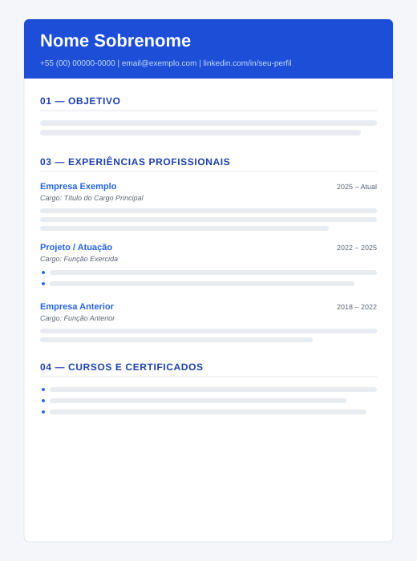

# Currículo — Gustavo de Camargo Costa

Fonte única de conteúdo que gera **duas versões** do currículo (Engenharia e Tecnologia) em **HTML** e **PDF**, com publicação automática no **GitHub Pages**.

A ideia central: você edita o conteúdo em Markdown uma vez, e as duas versões são geradas automaticamente. Só o objetivo muda entre elas.

O histórico de mudanças do projeto fica em [`CHANGELOG.md`](CHANGELOG.md).

## Índice

- [Exemplo visual](#exemplo-visual)
- [Estrutura](#estrutura)
- [Como atualizar o currículo](#como-atualizar-o-currículo)
- [Pré-visualização rápida (sem instalar Pandoc)](#pré-visualização-rápida-sem-instalar-pandoc)
- [Gerar localmente (HTML + PDF oficiais)](#gerar-localmente-html--pdf-oficiais)
- [Personalização (layout e cores)](#personalização-layout-e-cores)
- [Impressão: por que a faixa azul some?](#impressão-por-que-a-faixa-azul-some)
- [Publicar no GitHub (passo a passo)](#publicar-no-github-passo-a-passo)
- [Compartilhamento (SEO e prévia de link)](#compartilhamento-seo-e-prévia-de-link)

## Exemplo visual

Layout atual das versões (cabeçalho em faixa azul royal, datas alinhadas à
direita, cargo em itálico e seções com títulos em destaque):



> O exemplo acima é uma ilustração do layout. O conteúdo real é gerado a partir
> dos arquivos em `conteudo/`.

## Estrutura

```
.
├── conteudo/
│   ├── cabecalho.md       # Nome e contato (comum às duas versões)
│   ├── objetivo-eng.md    # Objetivo — versão Engenharia
│   ├── objetivo-ti.md     # Objetivo — versão Tecnologia
│   └── corpo.md           # Formação, experiências, cursos (comum)
├── site/
│   └── index.html         # Página inicial com links para as versões
├── estilo.css             # Visual compartilhado (HTML + PDF)
├── preview.py             # Pré-visualização rápida em HTML (sem Pandoc)
├── build.ps1              # Geração oficial — Windows (HTML + PDF via Pandoc)
├── build.sh               # Geração oficial — macOS/Linux (HTML + PDF via Pandoc)
├── .github/workflows/
│   └── build.yml          # Automação: gera e publica a cada push
├── docs/
│   └── exemplo-curriculo.svg  # Ilustração do layout (usada no README)
├── README.md              # Este arquivo
├── CHANGELOG.md           # Histórico de mudanças
└── build/                 # Saída gerada (não versionada)
```

> **Uma só fonte de verdade para o build:** o GitHub Actions (`build.yml`)
> reutiliza o próprio `build.sh` em vez de repetir os comandos do Pandoc. Assim,
> ao mudar uma opção do Pandoc ou adicionar uma nova versão do currículo, basta
> editar o `build.sh` (e o `build.ps1`, equivalente para Windows). O CI também
> fixa as versões de Python (3.12) e WeasyPrint (70.0) para builds reproduzíveis
> — veja [Publicar no GitHub](#publicar-no-github-passo-a-passo).

## Como atualizar o currículo

1. Edite os arquivos em `conteudo/`.
   - Mudou algo que vale para as duas versões? Edite `cabecalho.md` ou `corpo.md`.
   - Mudou só o foco/objetivo? Edite `objetivo-eng.md` ou `objetivo-ti.md`.
2. Faça commit e push.
3. O GitHub Actions gera os PDFs e atualiza a versão online sozinho.

## Pré-visualização rápida (sem instalar Pandoc)

Para só conferir o layout no navegador enquanto edita, use o `preview.py`.
Ele gera o HTML das duas versões usando apenas a biblioteca `markdown`:

```bash
pip install markdown      # apenas na primeira vez
python preview.py         # gera build/*.html e abre no navegador
```

Esse preview reflete fielmente cores, fontes e espaçamentos, pois usa o mesmo
`estilo.css`. Ao final, ele abre a **página inicial** (`build/index.html`) no
navegador, de onde você acessa as duas versões. Ele serve para visualização — a
geração oficial do PDF continua sendo feita pelo Pandoc (abaixo) e pelo GitHub
Actions.

## Gerar localmente (HTML + PDF oficiais)

A publicação online não depende disto — o GitHub Actions gera tudo na nuvem.
Use só se quiser gerar os PDFs na sua máquina.

### Windows

Pré-requisitos: [Pandoc](https://pandoc.org/installing.html) e, para PDF,
Python 3.10+ com `pip install "weasyprint==70.0"` (mesma versão do CI). No
Windows, o WeasyPrint ainda exige as bibliotecas GTK/Pango — veja as
[instruções de instalação](https://doc.courtbouillon.org/weasyprint/stable/first_steps.html#windows).
Se não quiser instalá-las, use `-SomenteHtml` e deixe o PDF por conta do CI.

```powershell
.\build.ps1                # HTML + PDF
.\build.ps1 -SomenteHtml   # apenas HTML (não exige WeasyPrint)
```

### macOS / Linux

Pré-requisitos: Pandoc e Python 3.10+ com WeasyPrint 70.0.

```bash
# macOS
brew install pandoc
pip3 install "weasyprint==70.0"        # mesma versão do CI

# Linux (Debian/Ubuntu) — inclui as libs nativas do WeasyPrint
sudo apt-get install -y pandoc libpango-1.0-0 libpangocairo-1.0-0 libgdk-pixbuf-2.0-0 libffi-dev libcairo2
pip3 install "weasyprint==70.0"
```

```bash
chmod +x build.sh    # apenas na primeira vez
./build.sh           # HTML + PDF
./build.sh --so-html # apenas HTML
```

Os arquivos aparecem em `build/`.

## Personalização (layout e cores)

Todo o visual fica no `estilo.css`. As cores são controladas por variáveis no
topo do arquivo (bloco `:root`):

| Variável            | Uso                                            | Valor atual |
|---------------------|------------------------------------------------|-------------|
| `--cor-faixa`       | Fundo da faixa do cabeçalho                     | `#1d4ed8`   |
| `--cor-primaria`    | Títulos de seção (ex: "03 — Experiências")      | `#1e40af`   |
| `--cor-secundaria`  | Títulos de experiência e links                  | `#2563eb`   |
| `--cor-texto`       | Texto do corpo                                  | `#2a2a2a`   |
| `--cor-suave`       | Cargo, datas e textos de apoio                  | `#5a6472`   |

Para trocar o tom de azul, basta alterar esses valores. A página inicial
(`site/index.html`) tem suas próprias cores no `<style>` — mantenha-as alinhadas
às variáveis acima para um visual consistente. A home também inclui
`print-color-adjust: exact`, então imprime os fundos corretamente (mesmo
comportamento dos currículos).

Outros ajustes úteis no `estilo.css`:

- **Tamanho da faixa:** `padding` da regra `h1` (e do `h1 + p`).
- **Tamanho do nome:** `font-size` da regra `h1`.
- **Datas à direita:** marcadas no conteúdo com `<span class="periodo">…</span>`
  e estiladas pela classe `.periodo`.
- **Justificação:** aplicada a `p` e `li` (com hifenização automática em pt-BR).
- **Quebra de página (PDF):** `p` e `li` usam `break-inside: avoid` para não
  partir parágrafos e itens entre páginas, mais `orphans`/`widows` para evitar
  linhas soltas. O cargo (`h3 + p`) e o título da experiência (`h3`) usam
  `break-after: avoid` para permanecerem junto do conteúdo seguinte. Uma
  experiência muito longa ainda pode ocupar mais de uma página, mas a quebra
  ocorre sempre entre blocos, nunca no meio do texto.

## Impressão: por que a faixa azul some?

Ao imprimir o **preview HTML** pelo navegador (Ctrl+P), por padrão ele não
imprime cores de fundo — por isso a faixa azul pode desaparecer. Para resolver:

- No diálogo de impressão, ative **"Gráficos em segundo plano"** (Chrome/Edge)
  ou **"Imprimir planos de fundo"** (Firefox).
- O `estilo.css` já inclui `print-color-adjust: exact`, que pede ao navegador
  para respeitar os fundos.

Isso vale apenas para a impressão pelo navegador. O **PDF oficial** gerado pelo
WeasyPrint (`build.ps1` / `build.sh` / GitHub Actions) renderiza a faixa azul
normalmente, sem precisar de nenhuma configuração.

## Publicar no GitHub (passo a passo)

```powershell
git init
git add .
git commit -m "Currículo inicial"
git branch -M main
git remote add origin https://github.com/SEU-USUARIO/curriculo.git
git push -u origin main
```

Depois, no repositório no GitHub:

1. Vá em **Settings → Pages**.
2. Em **Build and deployment → Source**, selecione **GitHub Actions**.

A partir daí, cada `git push` na branch `main` republica o site. A URL aparece em **Settings → Pages** (algo como `https://SEU-USUARIO.github.io/curriculo/`).

> **Build reproduzível:** o `build.yml` fixa a versão do Python
> (`actions/setup-python@v5`, 3.12) e do WeasyPrint (`weasyprint==70.0`), para
> que uma atualização futura de qualquer um deles não altere a renderização do
> PDF sem aviso. Ao querer atualizar, mude a versão de forma intencional e
> mantenha a mesma versão do WeasyPrint no `build.ps1`, no `build.sh` e no
> `README.md`.

## Compartilhamento (SEO e prévia de link)

A página inicial (`site/index.html`) inclui `meta description`, tags Open Graph
(`og:title`, `og:description`) e Twitter Card. Isso melhora a prévia ao
compartilhar o link no LinkedIn, WhatsApp e similares. Os HTMLs dos currículos
recebem uma `description` via `--metadata` do Pandoc (definida em `build.ps1` e
`build.sh`).
